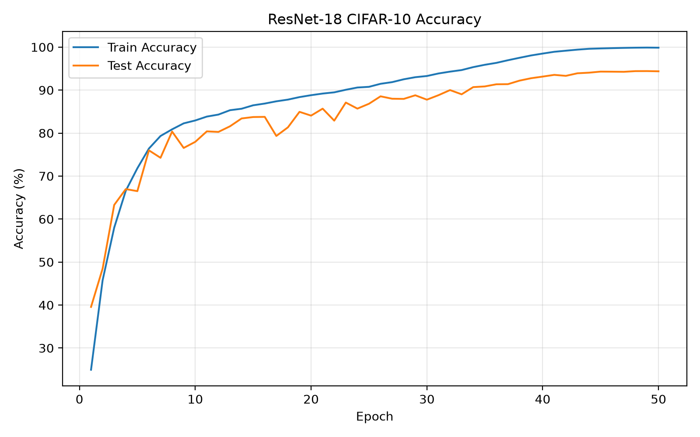
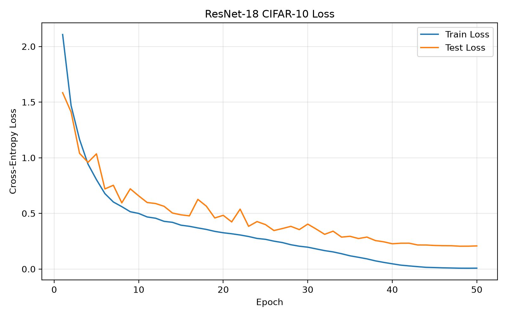
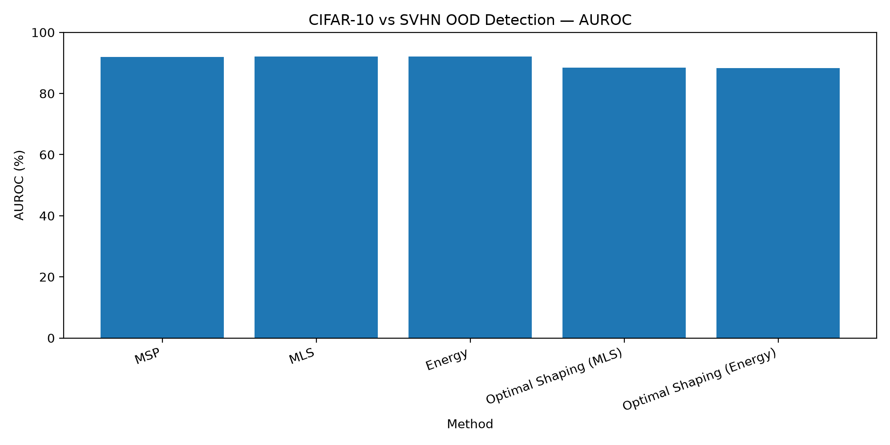
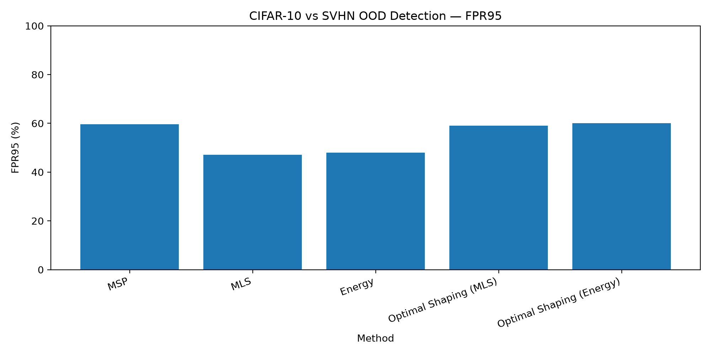

# Optimal Feature Shaping for Out-of-Distribution Detection

Reproduction and ResNet-18 adaptation of:

**Towards Optimal Feature-Shaping Methods for Out-of-Distribution Detection**
Qinyu Zhao et al., ICLR 2024

This project reproduces the core ID-only optimal feature-shaping method proposed in the paper and evaluates it for out-of-distribution (OOD) detection using CIFAR-10 as the in-distribution dataset and SVHN as the OOD dataset.

## Authors

- Sudheer Rathore — 31683
- Anser Abbas — 31675

---

## 1. Project Goal

The paper studies feature-shaping methods for out-of-distribution detection.

Instead of modifying or retraining the neural network, feature shaping operates on the penultimate feature representation of a trained classifier before the final linear classification layer.

The proposed method divides feature values into intervals and estimates how much features inside each interval contribute to the model's maximum logit.

Using only in-distribution training data, the paper derives a closed-form optimal feature-shaping function.

This repository reproduces that procedure in a reduced CIFAR-scale setting.

---

## 2. Reproduction Setup

### In-Distribution Dataset

**CIFAR-10**

- 50,000 training images
- 10,000 test images
- 10 classes
- Image size: 32 x 32

### Out-of-Distribution Dataset

**SVHN test set**

- 26,032 images
- Used only during OOD evaluation

SVHN is never used to learn the feature-shaping parameters.

### Model

We use a **ResNet-18 trained from scratch on CIFAR-10**.

The standard torchvision ResNet-18 was adapted for 32 x 32 CIFAR images:

- First convolution changed to 3 x 3, stride 1
- Initial max-pooling removed
- Final classifier outputs 10 CIFAR-10 classes
- Penultimate feature dimension: 512

This is an adaptation of the paper rather than an exact architectural reproduction.

The original paper evaluates CIFAR using architectures including DenseNet101, ViT-B-16, and MLP-Mixer-Nano.

---

## 3. Training Configuration

The ResNet-18 classifier was trained for 50 epochs.

Configuration:

- Optimizer: SGD
- Initial learning rate: 0.1
- Momentum: 0.9
- Weight decay: 5e-4
- Batch size: 128
- Scheduler: Cosine Annealing
- Random seed: 42
- Loss: Cross Entropy

Training augmentation:

- Random crop with padding 4
- Random horizontal flip
- CIFAR-10 normalization

Best CIFAR-10 test accuracy:

**94.42%**

The best checkpoint occurred at epoch 49.

---

## 4. Training Logs and Evidence

Training metrics were recorded for every epoch.

The complete training log is stored in:

```text
results/training_log.csv

```

The log contains:

- Epoch
- Training loss
- Training accuracy
- Test loss
- Test accuracy
- Learning rate

### Training and Test Accuracy



### Training and Test Loss



---

## 5. Feature Extraction

After training, the best ResNet-18 checkpoint is used as a fixed feature extractor.

The penultimate representation has 512 dimensions.

Features were extracted from all 50,000 CIFAR-10 training images, producing:

```text
torch.Size([50000, 512])
```

These in-distribution features are used to calculate the optimal feature-shaping function.

The extracted features are stored locally under `artifacts/` and are not committed to Git because they are large generated files.

---

## 6. Optimal Feature Shaping

The implementation follows the ID-only optimal feature-shaping method proposed by Zhao et al.

First, the feature-value range is determined from the CIFAR-10 training features using:

```text
Lower percentile: 0.1%
Upper percentile: 99.9%
```

For our trained ResNet-18:

```text
alpha = 0.000000
beta  = 1.710898
```

This range is divided into:

```text
K = 100
```

equal-width intervals.

For each CIFAR-10 training sample, the class producing the maximum logit is identified. The corresponding classifier weight vector is used to determine the contribution of each feature dimension.

For each feature-value interval, these contributions are summed to produce the Interval-Specific Feature Impact (ISFI).

The ISFI vectors are averaged across the ID training set to obtain:

```text
E_ID[I(z)]
```

The paper's closed-form ID-only solution is then used:

```text
theta* = sqrt(K) * E[I(z)] / ||E[I(z)]||_2
```

Our learned shaping vector produced:

```text
Theta shape:    [100]
Theta L2 norm:  9.999999
Theta minimum: -0.443721
Theta maximum:  1.907494
```

Because `sqrt(100) = 10`, the measured norm of approximately 10 provides a useful sanity check.

At inference time, each feature is multiplied by the theta value corresponding to its feature-value interval.

---

## 7. OOD Evaluation

The final OOD experiment uses:

```text
In-distribution:      CIFAR-10 test set
Out-of-distribution: SVHN test set
```

Five scoring configurations are evaluated:

- Maximum Softmax Probability (MSP)
- Maximum Logit Score (MLS)
- Energy
- Optimal Feature Shaping + MLS
- Optimal Feature Shaping + Energy

### Metrics

**AUROC** measures the ability to distinguish ID samples from OOD samples across thresholds.

Higher AUROC is better.

**FPR95** measures the percentage of OOD samples incorrectly accepted as ID when 95% of the ID samples are accepted.

Lower FPR95 is better.

---

## 8. OOD Detection Results

| Method | AUROC ↑ | FPR95 ↓ |
|---|---:|---:|
| MSP | 91.97% | 59.68% |
| MLS | **92.16%** | **47.15%** |
| Energy | 92.11% | 47.91% |
| Optimal Shaping (MLS) | 88.42% | 59.08% |
| Optimal Shaping (Energy) | 88.28% | 59.99% |

The raw results are stored in:

```text
results/ood_results.csv
```

### AUROC Comparison



### FPR95 Comparison



---

## 9. Comparison with Paper Results

The paper's CIFAR-10 results are averaged over multiple OOD datasets and use DenseNet101, ViT-B-16, and MLP-Mixer-Nano rather than our ResNet-18.

Therefore, the paper values below are provided only as reference and are **not directly comparable** to our CIFAR-10 → SVHN experiment.

| Method | Our AUROC | Our FPR95 | Paper CIFAR-10 Avg AUROC | Paper CIFAR-10 Avg FPR95 |
|---|---:|---:|---:|---:|
| MSP | 91.97% | 59.68% | 89.96% | 48.38% |
| MLS | 92.16% | 47.15% | 91.21% | 36.41% |
| Energy | 92.11% | 47.91% | 91.19% | 36.02% |
| Optimal Shaping (MLS) | 88.42% | 59.08% | 88.30% | 40.17% |
| Optimal Shaping (Energy) | 88.28% | 59.99% | 87.70% | 41.85% |

---

## 10. Analysis

In our ResNet-18 CIFAR-10 → SVHN experiment, optimal feature shaping did not improve OOD detection compared with the unmodified classifier.

The strongest result was obtained using raw MLS:

```text
AUROC = 92.16%
FPR95 = 47.15%
```

Optimal Feature Shaping with MLS produced:

```text
AUROC = 88.42%
FPR95 = 59.08%
```

Relative to raw MLS:

```text
AUROC change = -3.74 percentage points
FPR95 change = +11.93 percentage points
```

Therefore, feature shaping reduced OOD performance in this specific experiment.

This does not necessarily indicate an implementation failure. The original paper also reports that feature-shaping approaches are less effective on smaller CIFAR-scale benchmarks than on its larger ImageNet experiments.

Our experiment also differs from the paper's complete benchmark because:

- We use ResNet-18 rather than DenseNet101, ViT-B-16, or MLP-Mixer-Nano.
- Our ResNet-18 was trained from scratch.
- We evaluate only SVHN as the OOD dataset.
- The paper reports CIFAR results averaged across several OOD datasets.

This project should therefore be interpreted as an adapted reproduction of the core method rather than an exact replication of every experiment in the paper.

---

## 11. Repository Structure

```text
optimal-feature-shaping-ood-reproduction/
│
├── src/
│   ├── data.py
│   ├── model.py
│   ├── train.py
│   ├── extract_features.py
│   ├── feature_shaping.py
│   ├── evaluate_ood.py
│   └── plot_results.py
│
├── results/
│   ├── training_log.csv
│   ├── ood_results.csv
│   ├── training_accuracy.png
│   ├── training_loss.png
│   ├── ood_auroc.png
│   └── ood_fpr95.png
│
├── PROVENANCE.md
├── requirements.txt
├── .gitignore
└── README.md
```

Large generated files are excluded from Git, including:

```text
data/
checkpoints/
artifacts/
.venv/
```

---

## 12. Installation

Clone the repository:

```bash
git clone https://github.com/SJRATHORE/optimal-feature-shaping-ood-reproduction.git
cd optimal-feature-shaping-ood-reproduction
```

Create a virtual environment:

```powershell
python -m venv .venv
.\.venv\Scripts\Activate.ps1
```

Install dependencies:

```powershell
pip install -r requirements.txt
```

The main reproduction run used:

```text
Python:       3.12.10
PyTorch:      2.14.0+cu126
Torchvision:  0.29.0+cu126
CUDA:         12.6
GPU:          NVIDIA GeForce RTX 3060 Ti
```

---

## 13. Running the Reproduction

### Verify the data pipeline

```powershell
python -m src.data
```

### Verify the model

```powershell
python -m src.model
```

### Train ResNet-18

```powershell
python -m src.train --epochs 50
```

### Extract CIFAR-10 training features

```powershell
python -m src.extract_features
```

### Learn the optimal feature-shaping function

```powershell
python -m src.feature_shaping
```

### Evaluate OOD detection

```powershell
python -m src.evaluate_ood
```

### Generate plots

```powershell
python -m src.plot_results
```

---

## 14. Reproducibility and Logging

Training uses the fixed random seed:

```text
42
```

Metrics are logged after every epoch.

Experimental evidence preserved in this repository includes:

```text
results/training_log.csv
results/training_accuracy.png
results/training_loss.png
results/ood_results.csv
results/ood_auroc.png
results/ood_fpr95.png
```

Datasets, model checkpoints, and extracted feature tensors are intentionally excluded from Git because of their size.

---

## 15. Provenance

This is an educational reproduction.

The mathematical feature-shaping method, ISFI formulation, percentile limits, interval construction, and closed-form optimal shaping solution originate from Zhao et al.

Our project-specific implementation includes:

- CIFAR-10 and SVHN data pipeline
- CIFAR-specific ResNet-18 adaptation
- Training pipeline
- Per-epoch logging
- Feature extraction
- Feature-shaping implementation
- OOD evaluation
- Result plotting
- ResNet-18 / CIFAR-10 / SVHN experimental configuration

Detailed component provenance is recorded in:

```text
PROVENANCE.md
```

---

## 16. Reference

Qinyu Zhao et al.

**Towards Optimal Feature-Shaping Methods for Out-of-Distribution Detection**

ICLR 2024.

Official implementation:

https://github.com/Qinyu-Allen-Zhao/OptFSOOD
